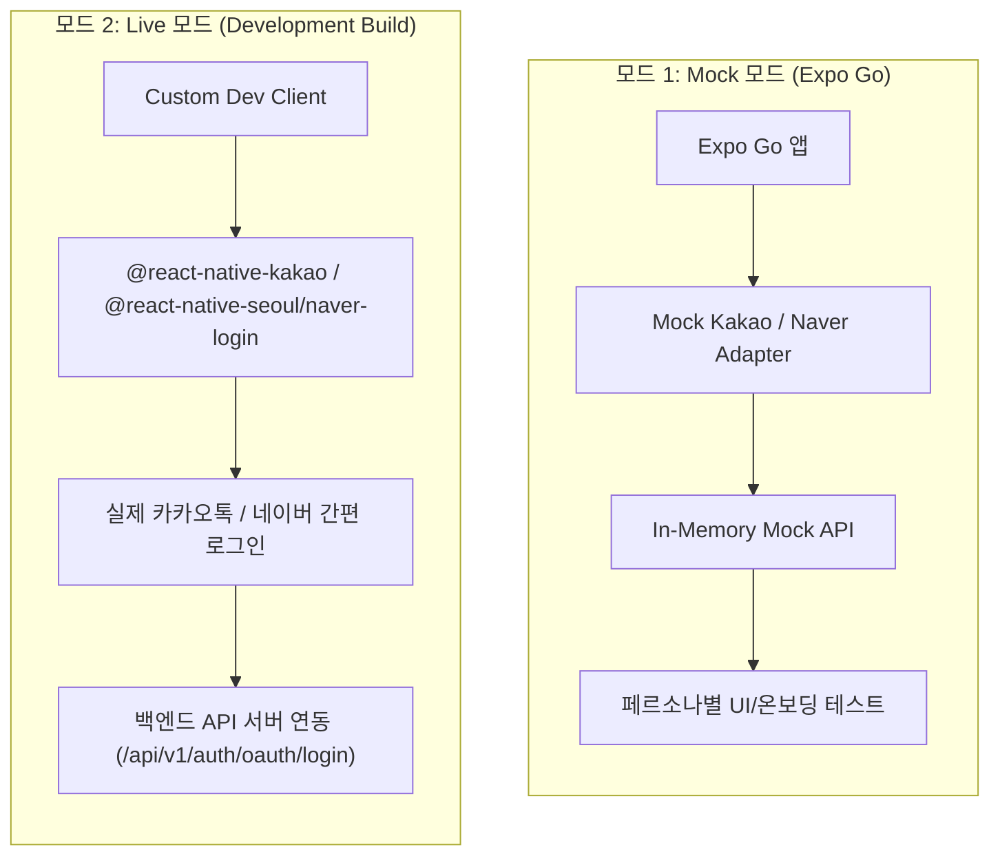

# goto-fe

2026년 관광데이터활용 공모전 **`함께가길`** 프로젝트의 프론트엔드 모바일 애플리케이션 저장소입니다.  
React Native 및 Expo SDK를 기반으로 접근성 중심의 무장애 관광 지도 및 길안내 서비스를 제공합니다.

---

## 🚀 빠른 시작 (Quick Start)

### 1. 패키지 설치
```bash
pnpm install
```

### 2. 로컬 환경 변수 파일 생성
루트 경로에 `.env.local` 파일을 생성합니다.

```bash
cp .env.example .env.local
```

---

## 🛠️ 개발 및 테스트 모드 안내

본 프로젝트는 개발 목적과 환경에 따라 **Mock 모드**와 **Live(실제 네이티브 SDK) 모드**의 2가지 방식을 제공합니다.



---

### [모드 1] Mock 모드 (Expo Go에서 빠른 개발/UI 검증)

> 💡 **왜 Mock 모드를 사용하나요?**  
> **Expo Go** 클라이언트는 사전 빌드된 샌드박스 앱으로, 서드파티 네이티브 모듈(예: Kakao/Naver Native SDK)의 바이너리가 포함되어 있지 않습니다.  
> 따라서 별도의 Xcode/Android Studio 빌드나 백엔드 서버 없이도 Expo Go 환경에서 카카오/네이버 로그인, 온보딩, 약관 동의, 프로필 설정 및 에러 시나리오를 즉시 테스트할 수 있도록 **In-Memory Mock 모드**를 지원합니다.

#### 1. `.env.local` 설정
```env
EXPO_PUBLIC_AUTH_MODE=mock
EXPO_PUBLIC_DEV_PERSONA=NEW_SIGNUP_USER
```

#### 2. 페르소나(Persona)별 테스트 시나리오
`EXPO_PUBLIC_DEV_PERSONA` 값을 변경하여 원하는 유저 상태로 즉시 시연할 수 있습니다.

| 페르소나 Key | 유저 유형 | 테스트 시나리오 및 검증 포인트 |
| :--- | :--- | :--- |
| `NEW_SIGNUP_USER` *(기본값)* | 신규 가입자 | 카카오/네이버 로그인 탭 시 `SIGN_UP_REQUIRED`가 반환되어 **약관 동의 → 닉네임 설정/중복확인 → 접근 권한 안내 → 이동 방식 선택 → 온보딩 완료** 전체 회원가입 플로우를 테스트합니다. |
| `WHEELCHAIR_USER` | 휠체어 이용 기가입자 | 로그인 즉시 세션이 복원되어 **메인 지도 화면**(`/(tabs)`)으로 바로 진입하며, 휠체어 보행 보조 맞춤형 프로필이 적용됩니다. |
| `STROLLER_USER` | 유모차 이용 기가입자 | 유모차 이동 보조 맞춤형 프로필이 설정된 기가입자 세션으로 즉시 메인 진입을 테스트합니다. |
| `SENIOR_VISUAL_USER` | 시각/고령자 기가입자 | 시각 보조 및 고령자 접근성 프로필이 설정된 기가입자 세션을 테스트합니다. |
| `NICKNAME_CONFLICT_USER` | 닉네임 중복 유저 | 회원가입 과정에서 닉네임 중복 충돌(409 Conflict) 발생 시 에러 피드백 및 재시도 UX를 테스트합니다. |

#### 3. 실행
```bash
pnpm start
```
터미널에서 `i` (iOS 시뮬레이터) 또는 `a` (Android 에뮬레이터)를 누르거나, Expo Go 앱으로 QR 코드를 스캔합니다.

---

### [모드 2] Live 모드 (실제 네이티브 SDK & 백엔드 연동)

실제 카카오톡/네이버 간편 로그인, 웹 인증창 및 백엔드 API와의 실시간 통신을 검증할 때는 **Expo Development Build**를 생성해야 합니다.

#### 1. 사전 준비 (개발자 콘솔 설정)

##### A. Kakao Developers 콘솔 설정
1. [Kakao Developers 콘솔](https://developers.kakao.com/)에 접속하여 애플리케이션을 생성/확인합니다.
2. **플랫폼 설정**:
   - **Android**: 패키지명 `net.beyondimagination.gotoapp` 등록 및 개발 환경의 Key Hash 등록
   - **iOS**: 번들 ID `net.beyondimagination.gotoapp` 등록
3. **카카오 로그인 활성화**: [카카오 로그인] 메뉴에서 활성화 및 OpenID Connect 등을 설정합니다.

##### B. Naver Developers 콘솔 설정
1. [Naver Developers 콘솔](https://developers.naver.com/apps/#/register)에 접속하여 애플리케이션을 등록합니다.
2. **사용 API**: `네이버 로그인` (회원 이름, 이메일, 프로필 사진, 별명 등 필요한 권한 설정)
3. **플랫폼 설정**:
   - **iOS 환경**:
     - 서비스 URL: `https://goto.beyond-imagination.net` (또는 `http://localhost`)
     - URL Scheme: `goto` (또는 `.env.local`의 `EXPO_PUBLIC_NAVER_SERVICE_URL_SCHEME`과 동일하게 지정)
     - Bundle ID: `net.beyondimagination.gotoapp`
   - **Android 환경**:
     - 서비스 URL: `https://goto.beyond-imagination.net` (또는 `http://localhost`)
     - 패키지명: `net.beyondimagination.gotoapp`
4. **내 애플리케이션 > 개요**에서 `Client ID`와 `Client Secret`을 확인합니다.

#### 2. `.env.local` 설정
```env
# Live 모드 활성화
EXPO_PUBLIC_AUTH_MODE=live

# Kakao OAuth App Key
EXPO_PUBLIC_KAKAO_NATIVE_APP_KEY=your_kakao_native_app_key_here

# Naver OAuth App Keys & Settings
EXPO_PUBLIC_NAVER_CONSUMER_KEY=your_naver_client_id_here
EXPO_PUBLIC_NAVER_CONSUMER_SECRET=your_naver_client_secret_here
EXPO_PUBLIC_NAVER_APP_NAME=함께가길
EXPO_PUBLIC_NAVER_SERVICE_URL_SCHEME=goto

# 백엔드 API 서버 URL (로컬 또는 원격)
# - 로컬 BE (iOS 시뮬레이터): http://localhost:8080
# - 로컬 BE (Android 에뮬레이터): http://10.0.2.2:8080
# - 원격 개발 서버: https://api.goto.beyond-imagination.net
EXPO_PUBLIC_API_BASE_URL=https://api.goto.beyond-imagination.net
```

#### 3. Development Build 생성 및 실행
네이티브 SDK가 링크된 standalone 바이너리를 빌드하여 시뮬레이터/에뮬레이터에 설치합니다.

* **iOS 시뮬레이터/기기**:
  ```bash
  pnpm ios
  # 또는 npx expo run:ios
  ```
* **Android 에뮬레이터/기기**:
  ```bash
  pnpm android
  # 또는 npx expo run:android
  ```

#### 4. Metro 개발 서버 실행
빌드된 Development Build 앱을 띄운 상태에서 메트로 번들러를 연결합니다:
```bash
pnpm start
```
*(터미널에서 `s` 키를 눌러 `development build` 모드로 전환할 수 있습니다.)*

---

## 📜 스크립트 레퍼런스

| 스크립트 | 명령어 | 설명 |
| :--- | :--- | :--- |
| **개발 서버 시작** | `pnpm start` | Metro 번들러를 **Dev 모드**(`__DEV__ === true`, Fast Refresh 활성화)로 실행합니다. |
| **프로덕션 번들 테스트** | `pnpm prod` | 최적화 및 코드 압축이 적용된 **Production 모드**(`expo start --no-dev --minify`)로 실행합니다. |
| **iOS 네이티브 빌드** | `pnpm ios` | iOS 네이티브 코드 Prebuild 및 시뮬레이터/기기 빌드/실행 (`expo run:ios`) |
| **Android 네이티브 빌드** | `pnpm android` | Android 네이티브 코드 Prebuild 및 에뮬레이터/기기 빌드/실행 (`expo run:android`) |
| **웹 실행** | `pnpm web` | 웹 브라우저용 번들러 실행 |
| **테스트 실행** | `pnpm test` | Node.js Test Runner를 사용하여 전체 단위/통합 테스트를 실행합니다. |
| **타입 검사** | `pnpm typecheck` | TypeScript 컴파일 에러를 검사합니다. |
| **린트 검사** | `pnpm lint` | ESLint 코드 스타일 및 규칙을 검사합니다. |

---

## 🔐 환경 변수 레퍼런스

| 환경 변수 | 기본값 / 예시 | 필수 여부 | 설명 |
| :--- | :--- | :---: | :--- |
| `EXPO_PUBLIC_AUTH_MODE` | `live` / `mock` | 선택 | `mock` (In-Memory 모의 인증) 또는 `live` (실제 카카오/네이버 SDK & BE) 설정 |
| `EXPO_PUBLIC_DEV_PERSONA` | `NEW_SIGNUP_USER` | 선택 | Mock 모드에서 사용할 페르소나 키 (`NEW_SIGNUP_USER`, `WHEELCHAIR_USER`, `STROLLER_USER`, `SENIOR_VISUAL_USER`, `NICKNAME_CONFLICT_USER`) |
| `EXPO_PUBLIC_API_BASE_URL` | `https://api.goto.beyond-imagination.net` | Live 시 필수 | 백엔드 API 서버 베이스 URL (`http://10.0.2.2:8080`, `http://localhost:8080` 등) |
| `EXPO_PUBLIC_KAKAO_NATIVE_APP_KEY` | `706f...` | Live 시 필수 (카카오) | Kakao Developers 콘솔에서 발급받은 Native App Key |
| `EXPO_PUBLIC_NAVER_CONSUMER_KEY` | `AbCdEf...` | Live 시 필수 (네이버) | Naver Developers 콘솔에서 발급받은 Client ID (Consumer Key) |
| `EXPO_PUBLIC_NAVER_CONSUMER_SECRET` | `aBcDeF...` | Live 시 필수 (네이버) | Naver Developers 콘솔에서 발급받은 Client Secret (Consumer Secret) |
| `EXPO_PUBLIC_NAVER_APP_NAME` | `함께가길` | 선택 | 네이버 로그인 창에 노출될 서비스 앱 이름 |
| `EXPO_PUBLIC_NAVER_SERVICE_URL_SCHEME` | `goto` | 선택 | iOS 네이버 로그인 완료 후 앱 복귀를 위한 URL Scheme |
